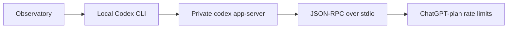

# AI Observatory

A lightweight native macOS menu bar utility for viewing current **Codex / ChatGPT plan usage** at a glance.

AI coding limits are useful operational information, but they usually live inside provider settings, slash commands, or web dashboards. AI Observatory is a Labs experiment: whether that number deserves a small, permanent place in the macOS menu bar, without becoming another account, backend, or analytics product.

**Codex is the only supported provider today.**

## What it does

The app is a SwiftUI menu bar extra. It does not appear in the Dock.

When a reading is available, the status item shows the available 5-hour and 7-day **remaining percentages** as a compact two-line readout, with 5H above 7D. If only one of those windows is available, it shows only that real window. Near exhaustion is determined per window by source usage reaching 95%; a provider reached-state still warns the constraining window. The affected remaining digits use the system warning color. If there is no reading yet, or the fetch failed, the bar shows a quiet gauge glyph instead of inventing a number.

Opening the popover confirms that glance. It shows:

- Codex, with plan as a subtitle when the provider returns one
- The 5-hour and 7-day remaining percentages as co-primary compact blocks, with a quiet **Remaining** cue on each
- Each window's length and reset time as local clock time (`Resets Thu 14:02`)
- Additional windows with remaining percentages, credits, or `Limit reached` only when those values are actually present
- When the snapshot was fetched
- Optional **Launch at Login**, backed by macOS ServiceManagement and reflected from the system registration state
- **Refresh** and **Quit**

Failure is explained in the popover, not in the menu bar: not signed in, Codex CLI missing, ChatGPT unreachable, or a generic read failure. The app refreshes approximately every 15 minutes while awake, with catch-up at wake or a known reset boundary. Manual Refresh remains the explicit path for an immediate read. The number in the bar is the last successful fetch, not a live ticker.

There is no Observatory account, no Observatory backend, no on-disk usage history, and no login form. Codex remains responsible for authentication.

## How it works

Quota is live provider data. Observatory does not reconstruct remaining allowance from local files; it derives the displayed remaining percentage from provider `usedPercent` at the presentation boundary.

On launch, on the coarse automatic cadence, or after Refresh it locates a local Codex CLI (`codex` on `PATH`, then the CLI bundled in ChatGPT.app), starts a **private** `codex app-server --stdio`, and reads ChatGPT-plan rate limits over JSON-RPC. The child process is torn down after the read. Codex continues to own its own login; Observatory does not copy credentials or talk to an Observatory server.



Because the quota lives with the provider, a successful read still needs network access. Offline, the app reports that it cannot reach ChatGPT rather than showing a fabricated meter.

## Status

AI Observatory is a **working Codex-only Labs prototype** and has passed its initial daily-use validation.

The core interaction is validated in real use: quota stays glanceable in the menu bar and refreshes automatically on a coarse 15-minute cadence, while manual Refresh remains available for an immediate provider read.

Post-implementation validation confirmed the full path end to end. The historical source used value moved from `9%` at `00:19` to `10%` at `00:34` after real Codex usage, without manual Refresh or relaunch; the shipped surface now shows the complementary remaining value.

The project remains intentionally narrow. Packaging, distribution, and additional providers are open questions rather than current commitments.

Use **Launch at Login** in the popover to register the installed app for future user logins. The control reflects macOS ServiceManagement state; if macOS requires approval, use the provided Login Items link in the popover.

## Privacy

- Observatory does not create or maintain a user account.
- Observatory does not copy, store, or refresh ChatGPT credentials.
- Sign-in stays with Codex / ChatGPT, as you already use them.
- Observatory speaks only to a local Codex app-server it starts itself.
- Usage numbers are fetched live from the provider. They are not an offline local metric, and they are not persisted. Quitting the app forgets the last snapshot.

## Running a local build

There is no downloadable release yet. The current way to try the app is to build it from source with Xcode.

**Requirements**

- macOS 14 or later
- Xcode
- Codex CLI available locally: `codex` on your `PATH`, or [ChatGPT for Mac](https://chatgpt.com/desktop) installed
- An existing ChatGPT / Codex sign-in (the same one Codex already uses)

**Build and run**

1. Clone this repository.
2. Open `AIObservatory.xcodeproj` in Xcode.
3. Run the `AIObservatory` scheme.

The target is an unsandboxed local debug/release build (ad-hoc signing). That is appropriate for a developer prototype; it is not a notarized, Sparkle-updated, or Mac App Store app.

From the command line:

```bash
xcodebuild -scheme AIObservatory -configuration Debug
```

### Build and install for daily use

To build the Release app into the repository's ignored `build/` directory and install it as a normal local macOS application:

```bash
./scripts/install-app.sh
open "/Applications/AI Observatory.app"
```

The script uses the shared `AIObservatory` scheme and builds into unique temporary DerivedData, so no repository-local `.app` build product is required. It installs `AI Observatory.app` in `/Applications`. If `/Applications` is not writable by your user, the script requests `sudo` only for the install replacement or removal of the old app. After the new bundle is verified, it removes the exact legacy `/Applications/AI Usage Observatory.app` copy; if that copy is running, the script requests a clean quit and stops for manual action if it does not exit. The installed app is a menu bar accessory, so it does not appear in the Dock. Open its menu bar item to view usage or choose **Refresh**.

If the Codex CLI cannot be found, the popover reports `Codex CLI not found.` If you are not signed in, it asks you to sign in with Codex or ChatGPT — it will not collect a password or token.

## Later exploration

The same kind of local, glanceable surface could later be explored for other AI coding tools (for example Claude Code, Cursor, Gemini, or GitHub Copilot). Those remain possible follow-up directions, not committed scope.

## License

MIT License; see [LICENSE](LICENSE).

The source code is licensed under the MIT License. The AI Observatory application icon, source artwork, and generated icon derivatives are excluded from that software license and are not separately licensed for reuse.
